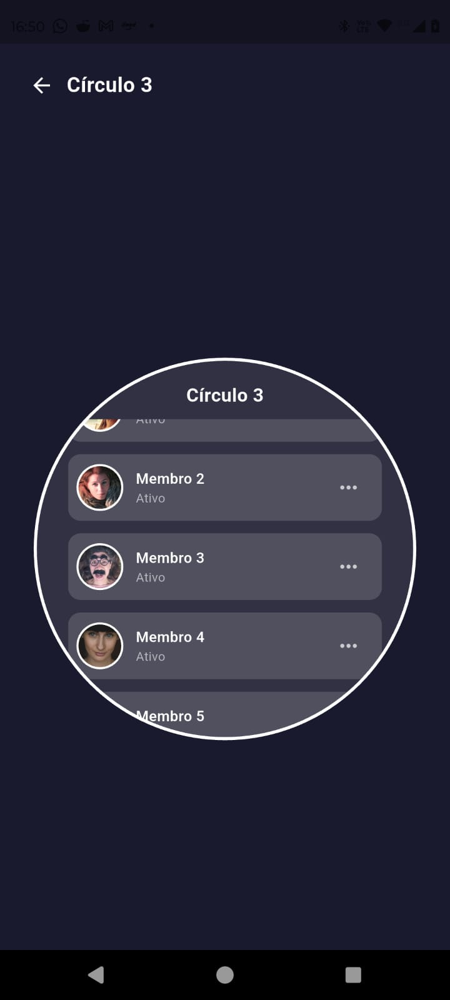
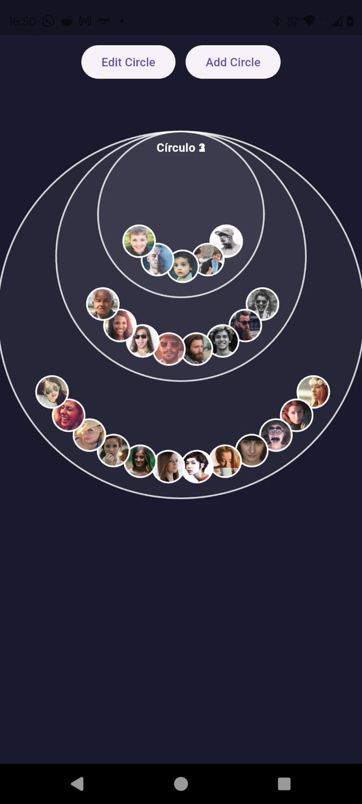

Concentric Circles Flutter App
Um aplicativo Flutter demonstrando uma interface de usuário inovadora com círculos concêntricos interativos que se reorganizam dinamicamente.

📸 Screenshots

   

📱 Sobre o Projeto
Este projeto exemplifica técnicas avançadas de UI/UX no Flutter, apresentando uma visualização única de círculos concêntricos que:

Se reorganizam conforme o scroll do usuário

Interagem com toques para expandir e contrair

Exibem avatares distribuídos harmonicamente em arcos

Mudam de aparência com efeitos visuais baseados na posição de scroll

🛠️ Tecnologias e Versões
Flutter: 3.32.0

Dart: 3.5.0

Dispositivo alvo: iOS e Android

✨ Funcionalidades Principais
Visualização hierárquica de círculos concêntricos

Efeitos de escala e transparência baseados em scroll

Detalhamento de círculos individuais ao tocar

Listagem de membros dentro de cada círculo

Botões de ação para gerenciamento dos círculos

Design com gradientes azuis e efeitos luminosos

🎨 Design e UX
O aplicativo implementa princípios de design modernos:

Fundo escuro para melhor contraste

Bordas com gradientes azuis para destaque

Animações suaves de transição

Layout responsivo que se adapta a diferentes tamanhos de tela

Feedback visual claro para interações do usuário

🚀 Como Executar
Certifique-se de ter o Flutter 3.32.0 instalado:

bash
flutter --version
Clone o repositório:

bash
git clone https://github.com/JoseGuilhermeAlves/teste_app.git
Acesse o diretório do projeto:

bash
cd teste_app
Instale as dependências:

bash
flutter pub get
Execute o aplicativo:

bash
flutter run
📁 Estrutura do Projeto
text
lib/
├── main.dart                 # Ponto de entrada do aplicativo
├── concentric_circles.dart   # Implementação principal dos círculos
└── ... (outros arquivos conforme evolução do projeto)
🔧 Personalização
Os aspectos visuais podem ser facilmente personalizados modificando:

Cores e gradientes nas constantes do projeto

Tamanhos e quantidades de círculos

Número de avatares exibidos

Efeitos de animação e transição